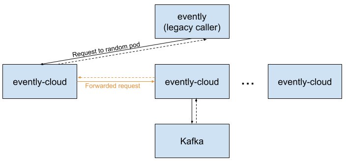
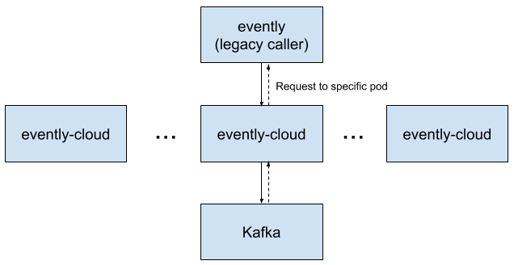

本文译自[Request affinity with istio](https://cashapp.github.io/2020-08-04/request-affinity-with-istio)。

## 背景介绍
很多 Cash App 的应用都会有一系列运行在 AWS 的 Kubernetes 集群上的分布式服务。们的工程团队也在几年前开始把应用迁移到 Kubernetes 上面， 最近我们才开始使用 Istio 作为一种服务网格的解决方案来解决我们服务之间的通信。在这篇文章里，我会专注在 Istio 接管流量负载均衡这一功能是如何大幅度的提高我们的服务的性能和稳定性。

服务网格以解决服务发现以及服务通信的问题见长，而其中一个吸引我们的功能就是如何将流量负载均衡分配到服务的 Pod 上面。在使用 Istio 之前，我们给每一个服务安放了一个它专用的 ELB 来负载分发流量。使用了 Istio 后，负载分发流量的任务就被下发至每个 Pod，不仅从网络流量中移除了负载均衡器，还提供了更加丰富的负载均衡配置功能。

## 问题所在

我们在 AWS 环境中部署了一套 Kafka 集群，用于异步的消息订阅和发布。另外还使用了一套 Kotlin 服务用于连接传统服务，evently-cloud，座落在传统服务跟 Kafka 之间，它暴露出一些 API 用于根据指定偏移量获取 Kafka 消息。

Kafka 客户端需要数秒钟时间来初始化并定位到 Kafka 主题中的指定偏移处。但是我们并不希望所有 API 调用都需要耗费数秒时间，因此，使用 evently-cloud 为每个消费者提前主动地缓存 Kafka 消息。为了保证这个缓存被高效使用，同一个主题和消费者的请求必须是由相同的 pod 来处理。也就是说，请求基于请求对应的 kafka 主题和特定的 pod 有一定的亲和性需求，而 pod 跟主题之前的亲和性问题则是由 evently-cloud 的代码解决的。在以前，当收到一个请求时，evently-cloud 会使用连续的哈希来确认哪些 pod 负责对应的主题，然后调用那些 pod 来获取 Kafka 数据，因为 evently-cloud 有很多的 pod，因此大部分的请求都是由两个不同的 pod 负责处理完成的：



实际上，这就会导致大范围的稳定性问题，其中主要问题就是会导致问题层层蔓延下去。由于一个请求刚好落到正确的 pod 上的几率是非常低的，因此很多 pod 浪费了大量的资源用于转发请求。而且性能调优又非常困难。更麻烦的是，当一个 pod 降级的时候会导致调用它的 pod 也跟着受牵连最终也降级，出于这些原因，evently-cloud 是非常脆弱并且难以使用的。 

## 解决办法：将亲和性需求交给 Istio

Istio 配置如何将请求负载均衡分配给其他服务，并且提供不同的负载均衡规则。默认情况下，Istio 使用 round robin 策略来平均的将请求分配给 pod，这个是可以根据不同服务配置不同规则的。

当我们从 evently-cloud 迁移到 Istio 时，我们对 Istio 进行了一些配置使得客户端使用确定性一致哈希算法。这些配置可以让客户端给每个请求配置一个可用于确认哪些 pod 会接收到这个请求的 HTTP 头。像以前一样，pod 的亲和性还是依赖于连续的哈希算法，但是现在哈希是在基础架构层解决的而不是在应用代码层面。

Istio 大部分的配置都是通过 Kubernetes 的 CRD 完成的，它也提供了一个概念叫 DestinationRule 来声明特定服务被调用时要触发什么动作。因此我们在 Kubernetes 集群里应用了以下的 YAML 来实现我们的需求：

```yaml
apiVersion: networking.istio.io/v1beta1
kind: DestinationRule
metadata:
  name: evently-cloud-deterministic-routing
  namespace: evently-cloud
spec:
  host: evently-cloud.evently-cloud.svc.cluster.local
  exportTo: ['*']
  trafficPolicy:
    loadBalancer:
      consistentHash:
        httpHeaderName: 'x-evently-topic-key'
```

你看，这就是我们在 Istio 上做的配置，不需要任何应用代码的变动甚至重启。

既然已经由 Istio 来决定并路由请求了，我们更新了 evently-cloud 让它碰到新的 Http 头时不要再转发到其他节点，这样也可以帮我们减少了一些复杂的代码。为了可以安全的实现这一机制，我们在 event-cloud 及其调用者中添加了各种功能标志，以在需要时允许旧的请求转发行为。

随着请求转发的需求移除了，大部分的请求跳动也就随着移除了：



## 结果


在这次变更之后，我们发现性能跟可用性都有了大幅的提升。

没有了请求转发的开销，我们在不影响 SLA 的情况下，将 evently-cloud 的 pod 数量从 100 个减少到 15 个。在上面的图形里，蓝线表示我们手动小幅度的减少 pod 的数量，相应的每个 pod 负责处理的请求数量也就上升了（粉红色线）。

这次变更不仅带来了更好的资源利用率，也更好的隔离了 pod 错误。降级的 pod 只会影响它对应的主题，不再会影响到整个 evently-cloud 集群了。

这篇文章中描述的 Istio 接管路由请求的方法只是我们在使用 Istio 中发现的诸多好处中的一个例子，其他亮点包括请求负载在服务 pod 之间的分发，使用 Istio Envoy sidecar 做 TLS 会话终结比默认的 JVM 配置更具性能优势，将 TLS 证书管理交给 Istio 等等。


希望您会喜欢学习 Istio 并用于解决实际问题。如果您喜欢处理基础架构问题，我们 Cash App 正在招聘哦！

致谢：我的同事 Ryan Hall 帮忙研究并实施这些变更，Jan Zantinge 协助我处理 Istio 项目迁移。